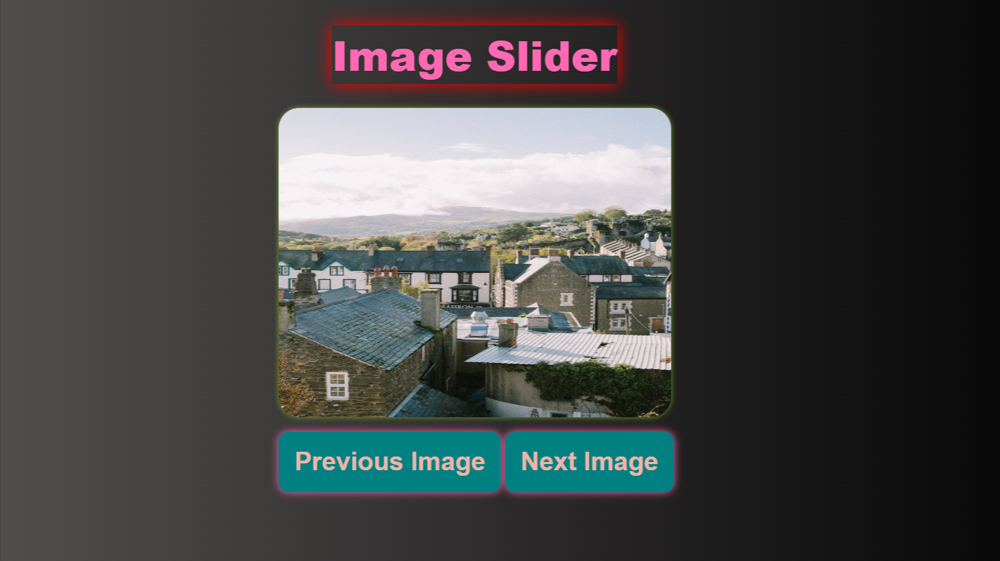
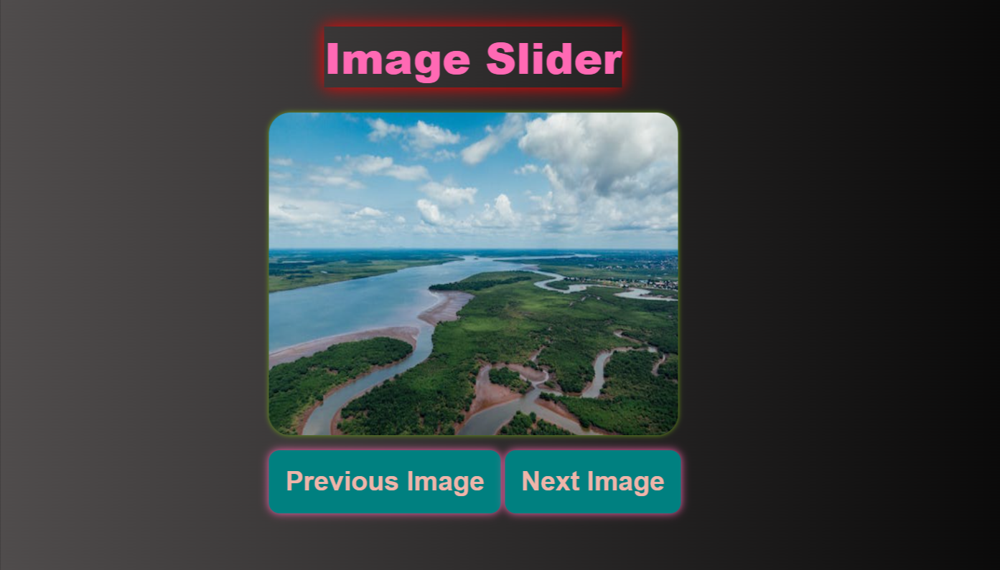

# **`Image Slider Project`**

 

> ## _This is my image-slider Project, I made it using HTML, CSS and Javascript._ [**Watch Live**](https://image-slider2044.netlify.app/ "This is netlify live links")

 

# 

 

## **Screenshot**

 

## **Let's Connect**

